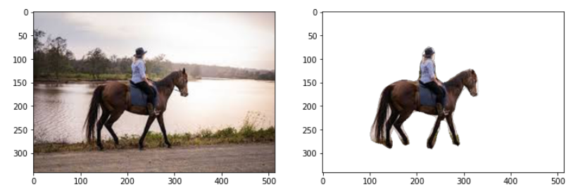
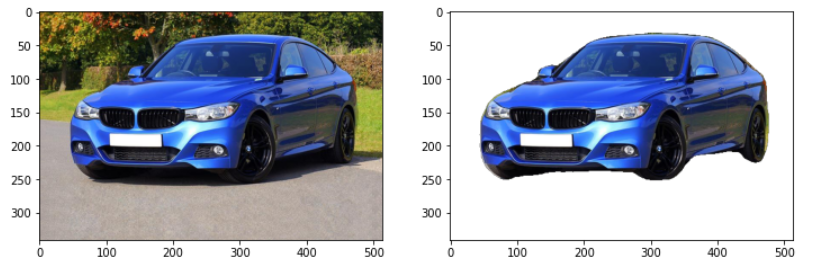

# Image-Background-Remover
Background removal is a task that is quite easy to do manually, or semi manually (Photoshop, and even Power Point has such tools) if you use some kind of a “marker” and edge detection. However, fully automated background removal is quite a challenging task, and as far as I know, there is still no product that has satisfactory results with it, although some do try.

Have a look!:)

